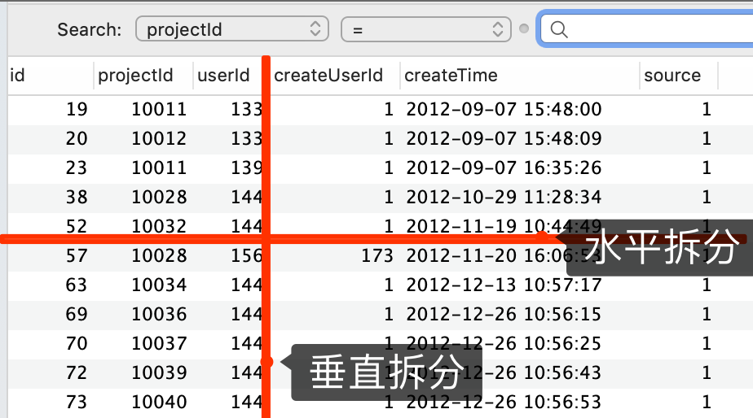

# MySql-分库分表

mysql单表存在性能瓶颈，随着数据量增大，达到某个阈值时，性能开始下降，

### 分区

由于物理上较为底层

### 分表

原理上与分区类似

#### 分表方式

按照维度通常可分为水平拆分以及垂直拆分

##### 垂直拆分

实际上是对表结构的拆分，将字段分散到多个表中。

- 按职能：保持单表职能结构清晰
- 按性能：将大字段或不常用字段剥离，保证主表性能。

##### 水平拆分

实际上是对数据的拆分，将数据分散到多个表中。保证单表数据规模，从而保证数据库性能。在不同的业务场景下，需要选择不同的拆分维度。

水平分表需提供一个或多个字段作为分表键，通过分表键建立数据和表索引的映射关系，包括读写操作(即哪条数据该写入到哪张表，该从哪张表里读取数据)。

- **哈希**

通过某种hash规则，建立数据和表的映射关系

- 优点：
  - 实现简单
  - 负载均衡，数据会分散在多张表中，读写压力自然也会均摊到多张表中，间接实现负载
- 缺点
  - 表索引变更，当需要增加或减少分表时，数据需要rehash来建立与表的映射关系，涉及到大量数据迁移

- **范围**

- id区间
- 时间范围

这两种方式本质上是相同的，数据写会集中在某一张表上

- 优点
  - 数据迁移影响范围小，
- 缺点
  - 单表性能压力，理论上数据规模不大影响不大。
  - 索引表，对于时间范围分表，通常还会通过主键查询的需求，这样就不得不建立

### 分库

当数据或流量达到一定规模之后，超过单个数据库实例最大承受限度，此时分表已无济于事，就需考虑分库了。