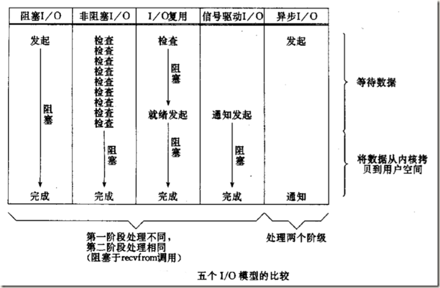
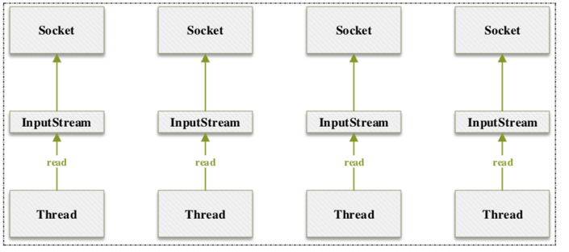

# 事件驱动

## 概念明晰

用通俗的语言解释下最经常提到的概念

1. 同步与异步

从获取事件状态的通知机制角度理解

>**同步**，主动轮询查询获取事件是否就绪；
>
>**异步**，被动监听，注册回调，当事件就绪回调通知。

还有一个角度

2. 阻塞与非阻塞

>可以理解为等待结果的动作，多为线程的状态
>
>**阻塞**，一直等待直到有数据才会返回，表现为线程挂起等待唤醒，等到有数据时在返回;
>
>**非阻塞**，服务端不管有没有数据会立即返回，线程去处理其它事物。

3. IO密集与CPU密集

> **CPU密集**，也叫计算密集型，多是执行耗CPU的计算操作
>
> **IO密集**，大量的网络、磁盘的IO操作，诸如用来做服务器处理请求

## Unix 网络编程中的5中IO模型

我们将服务端监听读请求的过程进行分析，这个过程实际上可以拆解为两个过程

- 等待数据
- 读取数据

我们以这两个过程对Unix网络编程中的5中IO操作进行划分解读

- **阻塞 –Blocking I/O (BIO)**

   系统调用一直阻塞线程直到数据到达或异常才会返回，同步阻塞

   ​        调用accept()（等待客户端的连接）或者read()（等待内核返回数据）方法，就会发生阻塞时，线程会挂起（Blocked状态），等到有数据就绪时，线程才会被唤醒，一个线程只能处理一个请求，而线程本身是相对重量耗资源的，开启的线程有限，服务器吞吐量有限。

- **非阻塞 Nonblocking I/O (NIO)**

   系统调用不管是否获取到数据都会立即返回，同步非阻塞。

   ​	调用read()方法无论内核是否读到数据都会立即返回。这样线程就有机会去处理别的请求或者计算任务。显然同一时间处理能力变强，但是这样就需要不断去轮询是否数据就绪，但是也会导致很多无用CPU资源的浪费。

- **多路复用 –I/O multiplexing  (select & poll)**

   多路复用可以理解为NIO的多线程实现，所以也是同步非阻塞。

   每条线程有一个多路复用器（Selector）将多个Socket注册在一个Selector上，因此一条线程具备处理多个网络请求的能力，多路复用是Reactor线程的核心，后文会具体阐述。

- **信号驱动 –signal driven I/O (epoll & kqueue)**

    Linux系统中的信号机制提供了一直通知某事情发生的方法。让内核在描述符就绪时发送 SIGIO 信号通知我们进行处理。实际上这个处理是自动的，只不过我们可以指定这个处理函数：

    这种方式要求进程执行以下3个步骤：

    1. 建立 SIGIO 信号的信号处理函数。

    2. 设置该套接字的属主，通常使用 `fcntl` 的 F_SETOWN 命令设置。

    3. 开启套接字的信号驱动 I/O 功能，通常通过使用 `fcntl` 的 F_SETFL 命令打开 O_ASYNC 标志完成。也可以改用 `ioctl` 的 FIOASYNC 请求。

       ​     信号驱动 I/O 模型的优势在于等待数据到达期间进程不被阻塞，进程可以继续执行。相比于非阻塞 I/O，信号驱动 I/O 没有询轮带来的昂贵的 CPU 代价。

- **异步 asynchronous I/O  (AIO)（IOCP）**

  	AIO又称NIO2.0，是异步非阻塞的IO模型，异步IO通知内核某个操作，并让内核在整个操作完成后通知应用程序

## 再看多路复用

多路复用处理数据的过程大体如下：

1. 向内核传入感兴趣事件集
2. 获取就绪事件集
3. 处理就绪事件
4. 用户逻辑处理

多路复用实现select，pselect，poll，epoll，kqueue，，接下来分别看下这几种多路复用的具体实现以及区别

### select

指定感兴趣的描述符集合（即OP_READ,OP_WRITE,OP_ACCEPT,OP_CONNECT），遍历当前进程socket事件，查找就绪事件
缺点： 

 1. 每次调用select，需要把fd_set从用户空间和内核空间之间进行拷贝，fd很多时开销很大
 2. 每次调用select都要在内核遍历进程的所有fd，fd很多时开销很大，随着fd增长而线性增长
 3. select支持的文件描述符有限，默认是1024

### poll

poll的实现和select非常相似，只是文件描述符fd集合的方式不同，poll使用pollfd结构而不是select的fd_set结构; poll不是为每个条件（读/写/异常）构造一个描述符集，而是构造一个pollfd结构，每个数组元素指定一个描述符编号以及我们对该描述符感兴趣的条件

poll和select同样存在一个缺点：包含大量文件描述符的数组被整体复制于用户态和内核的地址空间自己，无论是否就绪，开销随着文件描述符数量增加而增加。

poll不受fd数量显示，因为select以位图计算，因而处理fd数量已经限定，poll传入的是set

### epoll

epoll提供了三个函数，epoll_create,epoll_ctl和epoll_wait:

epoll_create是创建一个epoll句柄 epollfd；
epoll_ctl是注册要监听的事件类型；
epoll_wait则是等待事件的产生。
针对fd_set每次从用户空间和内核空间之间进行拷贝的缺点，epoll在 epoll_ctl函数中，每次在注册fd到epoll_create生成的epoll句柄时，把fd拷贝进内核，而不是在 epoll_wait的时候重复拷贝。因此，epoll保证每个fd只拷贝一次，在循环的epoll_wait不进行拷贝，而select和poll在循环中每次都需要拷贝。

针对select/poll在内核中遍历所有fd，epoll不会每次都将current（用户写select的线程）轮流加入fd对应设备的等待队列，而是在 epoll_ctl时把current挂一遍，并为每个fd指定一个回调函数，设备就绪唤醒等待队列上的线程时，会调用回调函数；回调函数把就绪的fd放入一个就绪链表。
epoll_wait的工作实际上就是在这个就绪链表中查看有没有就绪的fd（ schedule_timeout() 实现睡一会判断一会）

针对fd大小的限制，epoll没有限制，支持的fd上限时最大可以打开文件的数目，一般远大于2048，如1GB机器可打开的是10万左右 cat /proc/sys/fs/file-max可查看

epoll支持水平触发（LT，level trigger）和边缘触发（ET，edge trigger）两种模式
>LT(level triggered) 是默认/缺省的工作方式，同时支持 block和no_block socket。这种工作方式下，内核会通知你一个fd是否就绪，然后才可以对这个就绪的fd进行I/O操作。就算你没有任何操作，系统还是会继续提示fd已经就绪，不过这种工作方式出错会比较小，传统的select/poll就是这种工作方式的代表。

>ET(edge-triggered) 是高速工作方式，仅支持no_block socket，这种工作方式下，当fd从未就绪变为就绪时，内核会通知fd已经就绪，并且内核认为你知道该fd已经就绪，不会再次通知了，除非因为某些操作导致fd就绪状态发生变化。如果一直不对这个fd进行I/O操作，导致fd变为未就绪时，内核同样不会发送更多的通知，因为only once。所以这种方式下，出错率比较高，需要增加一些检测程序。

可以理解为LT水平触发，只要有数据可以读，不管怎样都会通知。而ET为边缘触发，只有状态发生变化时才会通知，可以理解为电平变化。（优缺点）

不管是哪种I/O机制，都无法避免fd在操作过程中拷贝的问题，而epoll使用了mmap(是指文件/对象的内存映射，被映射到多个内存页上)，所以同一块内存就可以避免这个问题。

只有，基于内核2.6版本之后的linux系统支持

### kqueue

与epoll类似，只是BSD系统上的实现

epoll与kqueue
性能
从性能角度讲，epoll存在一个设计上的缺陷；它不能在单次系统调用中多次更新兴趣集。当你的兴趣集中有100个文件描述符需要更新状态时，你不得不调用100次epoll_ctl()函数。性能降级在过渡的系统调用时表现的非常明显，这篇文章有做解释。我猜这是Banga et al原来工作的遗留，正如declare_interest()只支持一次调用一次更新那样。相对的，你可以在一次的kevent调用中指定进行多次兴趣集更新。
在kqueue中，kevent结构体支持多种非文件事件，包括 socket、信号、定时器、AIO、VNODE、PIPE

从之前的一片技术文章猜测epoll性能要好于kqueue，个人没有去做过比较和验证，但是这个还是依赖于操作系统

### 小结

多路复用具备了仅用一条线程处理大量请求的能力，

再从数据读取的四个过程过程看这几种多路复用实现的区别

| 过程 | select&poll  | epoll&kqueue |ICOP|
| :------------ |:---------------:| :----:|:----:|
| 注册感兴趣事件| 1024&无限制（系统） | 无限制（系统） | 无限制（系统） |
|获取就绪事件集 |主动轮询（系统）| 异步回调（系统） |异步回调（系统）|
| 处理就绪事件 |用户程序处理（用户）| 用户程序处理（用户） |系统处理（系统）|
| 应用程序处理| 用户程序处理（用户） |用户程序处理（用户） |用户程序处理（用户） |

## netty使用哪种IO模型？

​	由于多路复用属于系统调用，依赖于操作系统，linux内核2.6版本之后的开始支持epoll调用，而mac os则仅支持Kqueue，windows支持ICOP，JDK在启动的时候会根据操作系统自动选择选用哪种多路复用的实现，具体如下：

 - macosx: KQueueSelectorProvider
 - solaris: DevPollSelectorProvider
 - Linux: EPollSelectorProvider (Linux kernels >= 2.6)或 PollSelectorProvider
 - windows: WindowsSelectorProvider

接下来看下具体实现过程：可参考。。。

除此之外，netty针对以下两个特定平台进行优化

- Linux (4.0.16 起)
- MacOS/BSD (4.1.11 起)

落实到IO多路复用即Epoll以及Kqueue实现进行优化，主要涉及如下几个类

- `NioEventLoopGroup` → `EpollEventLoopGroup`
- `NioEventLoop` → `EpollEventLoop`
- `NioServerSocketChannel` → `EpollServerSocketChannel`
- `NioSocketChannel` → `EpollSocketChannel`

当然需要引入额外的依赖，工程应用具体配置参见[Native transports](http://netty.io/wiki/native-transports.html)

与基于NIO的传输相比，这些JNI传输添加特定于特定平台的功能，产生更少的垃圾，提高性能，具体如下：

 - Netty的epoll transport使用 epoll edge-triggered 而 java的 nio 使用
   level-triggered. 
 - netty epoll transport 暴露了更多的nio没有的配置参数， 如
   TCP_CORK, SO_REUSEADDR等等
   

## 扩展

java nio solector空轮询bug

描述：

Netty的解决办法

对Selector的select操作周期进行统计，每完成一次空的select操作进行一次计数，

若在某个周期内连续发生N次空轮询，则触发了epoll死循环bug。

重建Selector，判断是否是其他线程发起的重建请求，若不是则将原SocketChannel从旧的Selector上去除注册，重新注册到新的Selector上，并将原来的Selector关闭。

源码

## 参考文章

[聊聊同步、异步、阻塞与非阻塞](https://www.jianshu.com/p/aed6067eeac9)

[聊聊Linux 五种IO模型](https://www.jianshu.com/p/486b0965c296)

[Native transports](http://netty.io/wiki/native-transports.html)