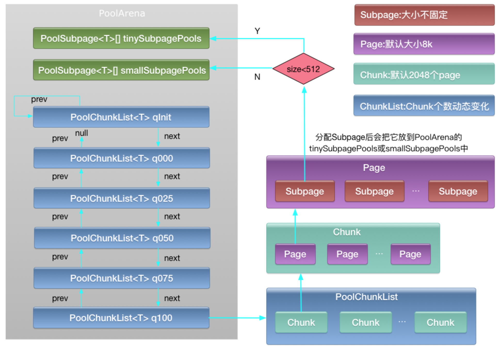

# netty-内存管理

池化与非池化
池化优势

 1. 资源可控，更加安全
 2. 减小创建和销毁的资源开销，性能更好。


我们日常接触到的池化技术有很多，线程池、连接池、对象池、内存池等，线程池与连接池并非本文的重点，这里着重介绍netty的对象池和内存池。

### 对象池

用于Bytebuf的分配和回收，通过Recycler实现，是一个基于thread-local栈的轻量级对象池。

#### 结构

Recycler是一个抽象类，在目标类中创建Recycler对象池实例时需要实现newObject(Handler handler)方法用来创建特定类的实例；

Recycler对象池的实现主要是通过三个核心组件：
Handler，WeakOrderQueue和Stack

1.Handle
**对象引用的直接封装**。Handle主要提供一个recycle接口，用于提供对象回收的具体实现，每个Handle关联一个value字段，用于存放具体的池化对象，在对象池中，所有的池化对象都被这个Handle包装，Handle是对象池管理的基本单位。另外Handle指向这对应的Stack，对象存储也就是Handle存储的具体地方由Stack维护和管理。Recycler在内部类中给出了Handle的一个默认实现：DefaultHandle,**每一个Handler绑定一个对象实例**

```
static final class DefaultHandle<T> implements Handle<T> {
    private int lastRecycledId;
    private int recycleId;

    boolean hasBeenRecycled;

    private Stack<?> stack;
    //绑定的对象实例
    private Object value;
}
```

2.Stack
**每条线程对象实例的缓存**。每条线程都有一个这样的Stack，通过threadLocal维护（threadLocal本质是一个HashMap，以thread为key，stack为value，为每一个线程存放一个变量的实例）。


```java
private final FastThreadLocal<Stack<T>> threadLocal = new FastThreadLocal<Stack<T>>() {
    @Override
    protected Stack<T> initialValue() {
        return new Stack<T>(Recycler.this, Thread.currentThread(), maxCapacityPerThread, maxSharedCapacityFactor,
                ratioMask, maxDelayedQueuesPerThread);
    }
};
```
Stack成员变量如下


```java

final Recycler<T> parent;
//弱引用
final WeakReference<Thread> threadRef;
final AtomicInteger availableSharedCapacity;
final int maxDelayedQueues;

private final int maxCapacity;
private final int ratioMask;
//用于存放对象实例数组
private DefaultHandle<?>[] elements;
private int size;
private int handleRecycleCount = -1; // Start with -1 so the first one will be recycled.
private WeakOrderQueue cursor, prev;
private volatile WeakOrderQueue head;
```
为每一条线程的队列维护一个队列，只追加一次，
当stack可用对象实例用尽，通过遍历清理这个集合获取可用对象实例，一个新线程而不是stack所对应线程回收
以最小的并发代价回收所有实例

注意：threadRef这个变量为一个弱引用，因为DefaultHandle里保留了持有了Stack的强引用，所以线程中介之后，如果不使用弱引用，用户将一个引用存储在DefaultHandle确从不清除，如果不使用弱引用，线程可能不会被回收掉

真正用于存储可用对象实例的是一个DefaultHandler数组。

向Recycler提供push和pop两个主要访问接口，pop用于从内部弹出一个可被重复使用的对象，push用于回收以后可以重复使用的对象。


3.WeakOrderQueue
**用来暂存待回收的对象**；用来回收不是当前线程创建的对象；
我们可以把WeakOrderQueue看做一个对象仓库，stack内只维护一个Handle数组用于直接向Recycler提供服务，当从这个数组中拿不到对象的时候则会寻找对应WeakOrderQueue并调用其transfer方法向stack供给对象。
WeakOrderQueue的功能可以由两个接口体现，add和transfer。add用于将handler（对象池管理的基本单位）放入队列，transfer用于向stack输入可以被重复使用的对象。
Stack的仓库是由WeakOrderQueue连接起来的链表实现的，Stack维护着链表的头部指针。而每个WeakOrderQueue又维护着一个链表，节点由Link实现，Link的实现很简单，主要是继承AtomicInteger类另外还有一个Handle数组、一个读指针和一个指向下一个节点的指针，Link巧妙的利用AtomicInteger值来充当数组的写指针从而避免并发问题
```java
//内部存储数据链头指针，对Link的封装
private final Head head;
private Link tail;
//指向下一个WeakOrderQueue，形成WeakOrderQueue链表
private WeakOrderQueue next;
private final WeakReference<Thread> owner;
private final int id = ID_GENERATOR.getAndIncrement();
```
weakOrderQueue内部是一个基于Link构成的链表，weakOrderQueue保留指向下一个weakOrderQueue实例的指针，
Link是weakOrderQueue的一个内部类，本身也是一个链表
```java
static final class Link extends AtomicInteger {
    //存储Hander实例的数组，绑定的值即为对象池中的对象实例
    private final DefaultHandle<?>[] elements = new DefaultHandle[LINK_CAPACITY];

    private int readIndex;
    Link next;
}
```
综上整理关系对象池结构如图


####对象的分配
按照对象分配的流程，会首先尝试


Recycler对象池内部是用一个对象数组维护对象池中的对象实例，对外提供统一的对象创建和回收接口：

Recycler#get方法 : 是获取对象池中对象的入口, 如果有可用对象,直接返回, 没有就调用newObject()方法创建一个。

Recycler#get
```java
    public final T get() {
        if (maxCapacityPerThread == 0) {
            return newObject((Handle<T>) NOOP_HANDLE);
        }
        //1. 通过threadLocal获取当前线程绑定的Stack
        Stack<T> stack = threadLocal.get();
        //2. 尝试从Stack中获取Handler实例
        DefaultHandle<T> handle = stack.pop();
        //2.1 如果没有则新建
        if (handle == null) {
            handle = stack.newHandle();
            handle.value = newObject(handle);
        }
        //2.2 如果有则直接返回
        return (T) handle.value;
    }
```
1.首先尝试从当前线程的缓存Stack中获取
Recycler首先从当前线程绑定的值中获取stack，我们可以得知Netty中其实是每个线程关联着一个对象池，直接关联对象为Stack，先看看池中是否有可用对象，如果有则直接返回，如果没有则新创建一个Handle，并且调用newObject来新创建一个对象并且放入Handler的value中，newObject由用户自己实现。
2.Stack#pop()
```java
DefaultHandle pop() {
    //获取当前stack实例可用对象实例个数
    int size = this.size;
    if (size == 0) {
        //执行清理
        if (!scavenge()) {
            return null;
        }
        size = this.size;
    }
    size --;
    //因为是采用栈的数据结构，数组中下标最大项对应的数据
    DefaultHandle ret = elements[size];
    if (ret.lastRecycledId != ret.recycleId) {
        throw new IllegalStateException("recycled multiple times");
    }
    初始化id
    ret.recycleId = 0;
    ret.lastRecycledId = 0;
    this.size = size;
    return ret;
}
```

首先看看Stack的elements数组是否有对象可用，如果有返回当前下标最大的元素。如果elements数组中已经没有对象可用，则需要从仓库中查找是够有可以用的对象，也就是scavenge的实现，

```java
        boolean scavenge() {
            // continue an existing scavenge, if any
            if (scavengeSome()) {
                return true;
            }

            // reset our scavenge cursor
            prev = null;
            cursor = head;
            return false;
        }
```
scavenge具体调用的是scavengeSome。

```java
boolean scavengeSome() {
    WeakOrderQueue prev;
    WeakOrderQueue cursor = this.cursor;
    if (cursor == null) {
        prev = null;
        cursor = head;
        if (cursor == null) {
            return false;
        }
    } else {
        prev = this.prev;
    }

    boolean success = false;
    do {
        if (cursor.transfer(this)) {
            success = true;
            break;
        }
        WeakOrderQueue next = cursor.next;
        if (cursor.owner.get() == null) {
            // If the thread associated with the queue is gone, unlink it, after
            // performing a volatile read to confirm there is no data left to collect.
            // We never unlink the first queue, as we don't want to synchronize on updating the head.
            if (cursor.hasFinalData()) {
                for (;;) {
                    if (cursor.transfer(this)) {
                        success = true;
                    } else {
                        break;
                    }
                }
            }

            if (prev != null) {
                prev.setNext(next);
            }
        } else {
            prev = cursor;
        }

        cursor = next;

    } while (cursor != null && !success);

    this.prev = prev;
    this.cursor = cursor;
    return success;
}
```


。

####对象的回收
Recycler#recycle方法: 是对象使用完毕后回收对象,只能回收当前线程创建的对象 现在已经标记@Deprecated不建议使用了, 建议使用Recycler.Handle#recycler方法，可以回收不是当前线程创建的对象, 复用性和性能更好了,DefaultHandle中的默认实现如下

```java
public void recycle(Object object) {
    if (object != value) {
         throw new IllegalArgumentException("object does not belong to handle");
    }
     stack.push(this);
}
```
这个stack就是创建Hander实例时绑定的Stack，由构造函数传入
接下来跟进push方法

```java
void push(DefaultHandle<?> item) {
    hread currentThread = Thread.currentThread();
    if (threadRef.get() == currentThread) {
    //当前线程是Stack绑定线程可以立即回收，放入栈中
    pushNow(item);
    } else {
    //当前线程不是Stack绑定线程或者stack实例绑定的线程已被回收，则稍后回收
    pushLater(item, currentThread);
    }
}
```
stack.pushNow方法

```java
        private void pushNow(DefaultHandle<?> item) {
            if ((item.recycleId | item.lastRecycledId) != 0) {
                throw new IllegalStateException("recycled already");
            }
            item.recycleId = item.lastRecycledId = OWN_THREAD_ID;

            int size = this.size;
            if (size >= maxCapacity || dropHandle(item)) {
                // Hit the maximum capacity or should drop - drop the possibly youngest object.
                return;
            }
            if (size == elements.length) {
                elements = Arrays.copyOf(elements, min(size << 1, maxCapacity));
            }

            elements[size] = item;
            this.size = size + 1;
        }
```

stack.pushLater方法

```java
        private void pushLater(DefaultHandle<?> item, Thread thread) {
            // we don't want to have a ref to the queue as the value in our weak map
            // so we null it out; to ensure there are no races with restoring it later
            // we impose a memory ordering here (no-op on x86)
            Map<Stack<?>, WeakOrderQueue> delayedRecycled = DELAYED_RECYCLED.get();
            WeakOrderQueue queue = delayedRecycled.get(this);
            if (queue == null) {
                if (delayedRecycled.size() >= maxDelayedQueues) {
                    // Add a dummy queue so we know we should drop the object
                    delayedRecycled.put(this, WeakOrderQueue.DUMMY);
                    return;
                }
                // Check if we already reached the maximum number of delayed queues and if we can allocate at all.
                if ((queue = WeakOrderQueue.allocate(this, thread)) == null) {
                    // drop object
                    return;
                }
                delayedRecycled.put(this, queue);
            } else if (queue == WeakOrderQueue.DUMMY) {
                // drop object
                return;
            }

            queue.add(item);
        }
```

####小结


### 内存池

#### 结构




#### 初始化

#### 内存的分配

#### 内存的回收

#### 小结


## netty 分配内存的完整过程


## 内存泄露检测

引用计数器与可达性分析


java为何会发生内存泄露


最简单的内存泄露实例


netty为何会发生内存泄露

netty buffer内存模型（分三层）

ByteBuf不再使用后（没有引用），没有调用release，导致ByteBuf资源一直被占用无法回收


netty检测内存泄露原理

**原理：**每次创建ByteBuf时，创建一个虚引用对象A指向该ByteBuf对象，如果正常调用release()操作，则虚引用对象A和ByteBuf对象均被回收；如果ByteBuf对象不再使用（没有其他引用）但没有调用release()操作，则GC时虚引用对象A被加入ReferenceQueue中，通过判断队列是否为空，即可知道是否存在内存泄露。


## 参考文章

[Netty源码分析（八）—内存池分析](https://blog.csdn.net/u013967175/article/details/78627801)

https://my.oschina.net/andylucc/blog/614589

https://blog.csdn.net/u013967175/article/details/78627769

[netty 堆外内存泄露排查盛宴](https://www.jianshu.com/p/4e96beb37935?hmsr=toutiao.io&utm_medium=toutiao.io&utm_source=toutiao.io)