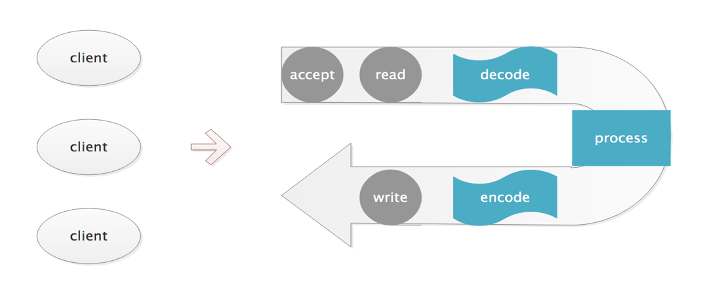
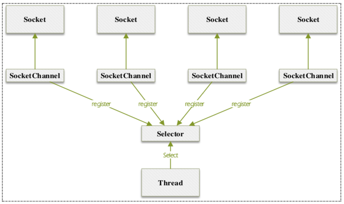
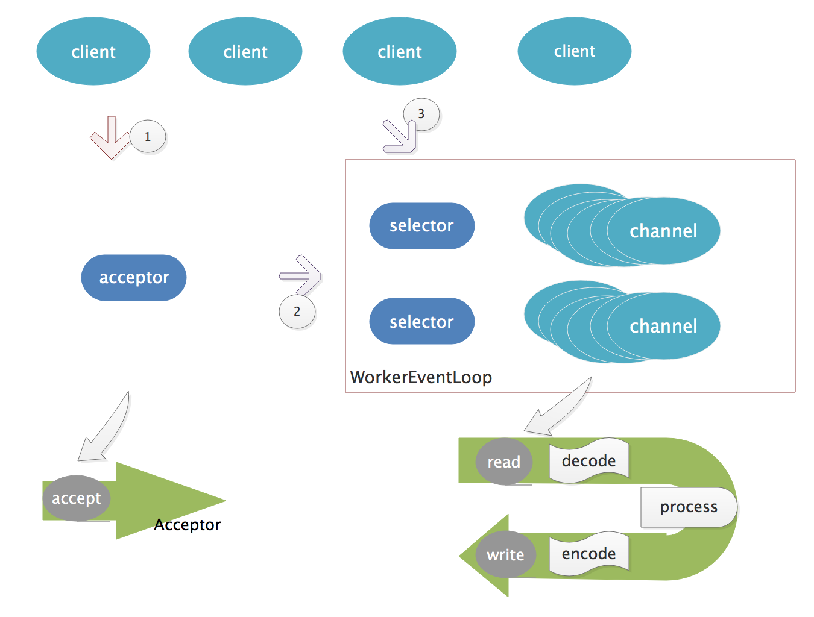
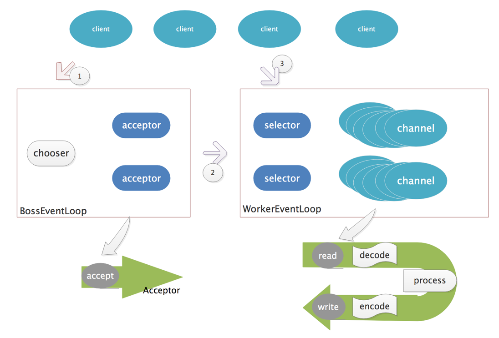

# 线程模型

## 传统阻塞线程模型

​	阻塞线程模型对应BIO（Blocking IO）的IO模型，以服务端为例，线程会阻塞在accept事件等待请求，待客户端连接，读取数据，解码，完成逻辑处理并封装响应，编码，返回给客户端。如下图



1. 单线程  

   ​	最传统最简洁的线程模型，线程阻塞无法继续处理，同一时间只能处理一个IO

2. 多线程

   ​        充分利用CPU多核的优势 可以开启多个线程并行处理任务，以网络IO为例，可以并行处理多个socket，但是一条线程还是同时只能处理一个请求，线程的创建、消耗以及上下文切换本身是十分消耗资源的。

3. 线程池

   ​	多线程碎岩提高了处理能力，但是频繁的创建和销毁线程十分消耗系统资源，而且不利于资源的管理，容易造成系统资源耗尽。采用线程池可以有效解决这些问题，但是终归没有解决一条线程同时只能处理一个请求的问题。

   

   

## Reactor线程模型

​	Reactor线程模型对应IO多路复用模型（具体看事件驱动一文），每一条线程会绑定一个多路复用器，用一个多路复用器监听多个请求的IO事件，可处理多个客户端请求。通过向多路复用器注册感兴趣事件，待有事件触发时才去处理。



1. 单线程Reactor

   ​	Reactor线程将处理连接过程和处理数据过程分离开来，线程会处理TCP连接请求，成功建立连接之后会将其注册到多路复用器Selector上，这样当有感兴趣事件到来时，才会去处理，一条线程可以处理多个请求，吞吐量大大增加。

2. 多线程Reactor(1,N)

   ​	事实上针对网络IO可以分解成两个过程来看，一个是建立连接的过程，另一个是建立连接之后的数据处理过程，即读取-解码-处理-编码-写出。传统线程模型采用同一条线程顺序处理这个这两个过程，造成资源的浪费。多线程模型将这两个过程分离开来，用一个线程处理连接请求，将建立的连接投递到一个线程池中，来处理后续过程。具体内容如下：

   

   

   1. 创建一个NIO线程作为Acceptor线程，注册OP_ACCEPT事件，监听客户端的TCP连接请求；
   2. 创建一个NIO线程池，其中线程作为Selector线程，用于处理读写、编解码等后续过程，它包含一个任务队列和N个可用的线程；
   3. 图中①过程，客户端连接请求到来，通过Accepetor线程完成握手并建立连接；
   4. 图中②过程，客户端将建立的连接注册到Selector上，并注册OP_READ事件，等待数据
   5. 图中③过程，当客户端发送数据，服务端有数据到来开始读取数据
   6.  一个NIO线程可以同时处理多个客户端事件，但是一个客户端连接生命周期内只会注册在一个多路复用器上，故而只会被一条线程处理，因而可以规避很多并发问题，同时由于读取之后的处理通常是连续的，减少线程上下文切换开销。

3. 主从多线程Reactor(M,N)

   ​	单个线程处理连接请求可能存在性能瓶颈，同处理业务一样，采用线程池来处理连接请求，并提供chooser用来选取一条线程作为acceptor线程。即双线程结构，具体细节将会在netty线程模型一节详细展开

   

## Proactor线程模型

​	Proactor线程模型对应AIO线程模型，我们在Reactor的基础上分析，弄清楚与Reactor的区别，自然就很好理解Proactor的原理。而Proactor与Reactor的区别主要表现在它们依赖的IO模型，即epoll || kqueue与ICOP的区别

| 处理过程             | Reactor | Preactor |
| :------------------- | :-----: | :------: |
| 注册感兴趣事件       | Reactor | Preactor |
| 获取就绪事件集       | Reactor | Preactor |
| 处理就绪事件（read） |  用户   | Preactor |
| 用户业务逻辑         |  用户   |   用户   |

​	总的来说区别就是Reactor线程最多只是完成了事件就绪通知用户程序去读取，而Proactor线程则直接完成了数据的读取通知用户程序可以直接使用数据进行业务逻辑的处理了

​	Proactor实现逻辑复杂；依赖操作系统对异步的支持，目前实现了纯异步操作的操作系统少，实现优秀的如windows IOCP，但由于其windows系统用于服务器的局限性，目前应用范围较小；而Unix/Linux系统对纯异步的支持有限，应用事件驱动的主流还是通过select/epoll来实现；

## netty线程模型

​	netty线程模型采用的是reactor线程模型实现

​	服务端启动的时候会创建两个线程池，分别为BossEventLoopGroup以及WorkerEventLoop，新建线程池的构造方法中可以传入整形参数，用于指定线程池中线程的个数，若不指定默认为CPU核数 * 2，通过指定参数可以实现多线程（1，n）以及主从多线程（m，n）Reactor。以一个http服务端为例

```java
EventLoopGroup bossGroup = new NioEventLoopGroup(1);
EventLoopGroup workerGroup = new NioEventLoopGroup();
try {
    ServerBootstrap b = new ServerBootstrap();
    b.group(bossGroup, workerGroup)
     .channel(NioServerSocketChannel.class)
     .handler(new LoggingHandler(LogLevel.INFO))
     .childHandler(new ChannelInitializer<SocketChannel>() {
        @Override
        public void initChannel(SocketChannel ch) {
            ChannelPipeline p = ch.pipeline();
            p.addLast(new HttpRequestDecoder());
            p.addLast(new HttpResponseEncoder());
            p.addLast(new HttpSnoopServerHandler());
        }
    });

    Channel ch = b.bind(PORT).sync().channel();

    ch.closeFuture().sync();
} finally {
    bossGroup.shutdownGracefully();
    workerGroup.shutdownGracefully();
}
```

​	客户端与服务端主动发起连接，因而只需一个线程池即可，待建立连接即可发送数据

``` java
//仅需一个线程池用于发起连接请求
EventLoopGroup group = new NioEventLoopGroup();
try {
    Bootstrap b = new Bootstrap();
    b.group(group)
     .channel(NioSocketChannel.class)
     .handler(new ChannelInitializer<SocketChannel>() {
         @Override
         public void initChannel(SocketChannel ch) {
             ChannelPipeline p = ch.pipeline();
             p.addLast(new HttpClientCodec());
             p.addLast(new HttpContentDecompressor());
             p.addLast(new HttpSnoopClientHandler());
         }
     });

    // 发起连接尝试
    Channel ch = b.connect(host, port).sync().channel();

    // 准备请求数据
    HttpRequest request = new DefaultFullHttpRequest(
            HttpVersion.HTTP_1_1, HttpMethod.GET, uri.getRawPath());
    request.headers().set(HttpHeaderNames.HOST, host);
    request.headers().set(HttpHeaderNames.CONNECTION, HttpHeaderValues.CLOSE);
    request.headers().set(HttpHeaderNames.ACCEPT_ENCODING, HttpHeaderValues.GZIP);

    // 发送http请求
    ch.writeAndFlush(request);

    ch.closeFuture().sync();
} finally {
    group.shutdownGracefully();
}
```


