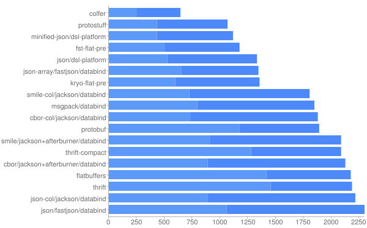
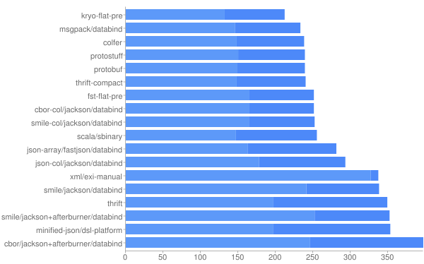

# netty-编解码

[TOC]

## 什么是编解码？

数据以字节流形态在网络中传输，这些数据并不能直接被程序所理解，只是一堆无用的字节序列，因而要建立约束规则，发送和接收时同时遵守，才可以将客户端请求数据在服务端进行还原，数据在由应用程序写入到网络的过程即为编码。

## TCP粘包、拆包

我们在应用程序中所处理的消息，由于TCP不了解上层业务数据，可能会将一个应用层报文信息拆开发送（拆包），或者多个报文信息组合发送（粘包），导致接收端无法正确理解数据含义，解码错误。


发生TCP拆包、粘包具体原因大致如下：

1. 发送缓冲区过小，数据无法一次发出，这将会发生拆包。
2. 数据远小于发送缓冲区，导致多个数据报文堆积一起发送，这将会发生粘包。
3. 进行MSS（最大报文长度）大小的TCP分段，当TCP报文长度-TCP头部长度>MSS的时候将发生拆包。
4. 接收方法不及时读取缓冲区数据，这将发生粘包。


## netty编解码实现
netty主要提供四个基础类

 - ByteToMessageDecoder 
 - MessageToMessageDecoder 
 - MessageToByteEncoder
 - MessageToMessageEncoder


ByteToMessageDecoder是netty解码器的基础，


下面结合代码详细分析，具体的使用方法类注释上已经进行了详细说明

首先通过累加器对ByteBuf内的数据进行聚合，

```java
public interface Cumulator {
    ByteBuf cumulate(ByteBufAllocator alloc, ByteBuf cumulation, ByteBuf in);
}
```

累加器实际上就是一个接口，有一个cumulate方法。


ByteToMessageDecoder中提供了两种累加器。

```java
public static final Cumulator MERGE_CUMULATOR
public static final Cumulator COMPOSITE_CUMULATOR
```

- MERGE_CUMULATOR 合并累加器，通过内存拷贝实现累加
- COMPOSITE_CUMULATOR 复合累加器，通过指针引用复合实现累加，具体使用的是CompositeByteBuf

netty使用MERGE_CUMULATOR作为默认累加器，为什么呢？方法注释里这样解释

> CompositeByteBuf使用了一套更加复杂的索引实现，因此依赖于使用场景和解码实现，可能会比直接使用MERGE_CUMULATOR还要慢。

解码器本质上也是一个ChannelInboundHandler，因此其读取到数据首先要经由channelRead方法读入处理。

```java
public void channelRead(ChannelHandlerContext ctx, Object msg) throws Exception {
    if (msg instanceof ByteBuf) {
        CodecOutputList out = CodecOutputList.newInstance();
        try {
            ByteBuf data = (ByteBuf) msg;
            //判断累加器是否为null，若为null则指向当前传进的msg，若不为null则进行累加操作
            first = cumulation == null;
            if (first) {
                cumulation = data;
            } else {
                cumulation = cumulator.cumulate(ctx.alloc(), cumulation, data);
            }
            //调用解码方法
            callDecode(ctx, cumulation, out);
        } catch (DecoderException e) {
            throw e;
        } catch (Exception e) {
            throw new DecoderException(e);
        } finally {
            //累加器无数据可读
            if (cumulation != null && !cumulation.isReadable()) {
                numReads = 0;
                cumulation.release();
                cumulation = null;
              //已读数据次数大于该清理阈值(默认为16)
            } else if (++ numReads >= discardAfterReads) {
               //清理部分字节，防止OOM
                // See https://github.com/netty/netty/issues/4275
                numReads = 0;
                discardSomeReadBytes();
            }

            int size = out.size();
            decodeWasNull = !out.insertSinceRecycled();
            fireChannelRead(ctx, out, size);
            out.recycle();
        }
    } else {
        ctx.fireChannelRead(msg);
    }
}
```

解码过程大体如下：

1. 累加数据 
2. 将累加到的数据传递给业务进行业务拆包 
3. 清理字节容器 
4. 传递业务数据包给业务解码器处理

核心方法是callDecode(ctx, cumulation, out);方法，方法如下：

```java
protected void callDecode(ChannelHandlerContext ctx, ByteBuf in, List<Object> out) {
    try {
        while (in.isReadable()) {
            int outSize = out.size();

            //第一次执行不会进入，第二次进入
            if (outSize > 0) {
                //继续读取
                fireChannelRead(ctx, out, outSize);
                out.clear();

                //检查handler是否被移除
                if (ctx.isRemoved()) {
                    break;
                }
                outSize = 0;
            }

            //记录可读字节，即待解码字节数
            int oldInputLength = in.readableBytes();
            //调用业务解码方法，是一个抽象方法需在继承ByteToMessageDecoder的类中由用户实现
            decodeRemovalReentryProtection(ctx, in, out);
            
            //在开始循环之前再次检测
            // See https://github.com/netty/netty/issues/1664
            if (ctx.isRemoved()) {
                break;
            }

            //比较out对象是否有变化，相等就说明没有解析出数据包
            //这里注意的是java是传址，decodeRemovalReentryProtection方法内对out的修改会在这里生效
            if (outSize == out.size()) {
                //如果没有读取到数据直接退出循环
                if (oldInputLength == in.readableBytes()) {
                    break;
                } else {
                    //已读取还未读取完，继续循环
                    continue;
                }
            }

            //解析出数据包确没有读取数据，抛出异常
            if (oldInputLength == in.readableBytes()) {
                throw new DecoderException(
                        StringUtil.simpleClassName(getClass()) +
                                ".decode() did not read anything but decoded a message.");
            }

            if (isSingleDecode()) {
                break;
            }
        }
    } catch (DecoderException e) {
        throw e;
    } catch (Exception cause) {
        throw new DecoderException(cause);
    }
}
```

decodeRemovalReentryProtection 方法如下：其中decode方法要用户继承Byte

```java
final void decodeRemovalReentryProtection(ChannelHandlerContext ctx, ByteBuf in, List<Object> out)
        throws Exception {
    decodeState = STATE_CALLING_CHILD_DECODE;
    try {
        decode(ctx, in, out);
    } finally {
        boolean removePending = decodeState == STATE_HANDLER_REMOVED_PENDING;
        decodeState = STATE_INIT;
        if (removePending) {
            handlerRemoved(ctx);
        }
    }
}
```


基于ByteToMessageDecoder实现解码器仍有难度，netty封装了成熟的解码器用于结局TCP粘包、拆包问题。

- DelimiterBasedFrameDecoder 消息边界
- FixedLengthFrameDecoder 固定长度
- LengthFieldBasedFrameDecoder 消息头指定消息长度
- LineBasedFrameDecoder  回车换行符

我们来逐个分析一下


##  编解码框架效率对比

我们平时已经接触过一些编解码的协议，比如protobuf、Thrift、Marshalling、MessagePack、kryo、hession和Json等。

选择编解码框架要考虑很多因素 

1. 跨语言支持
2. 功能
3. 社区
4. ...

而性能上主要关注以下两点

1. 编解码效率
2. 编码后码流大小

针对各种编解码协议，github上[jvm-serializers](#https://github.com/eishay/jvm-serializers/wiki) 项目对各个编解码框架进行了测评。里面涉及的参数比较多，有需求可以戳进去自己看下，放两张图，这里就不再展开。






参考文献

[jvm-serializers](https://github.com/eishay/jvm-serializers/wiki)