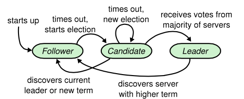

# 分布式——一致性

[TOC]

## 一致性

​        分布式应用通常会建立多个数据副本用于灾备处理，提高可用性的同时也增加了副本之间的数据同步和一致性保障的难度。一致性大体上可以分为强一致性和弱一致性(最终一致性)

- 强一致性：系统中的某个数据被成功更新后，后续任何对该数据的读取操作都将得到更新后的值；
- 弱一致性：

### NWR机制

通过NWR机制来说明

- **N**：有多少份数据副本
- **W**：一次成功的写操作至少有w份数据写入成功
- **R**：一次成功的读操作至少有R份数据读取成功

如果W+R>N，写的节点和读的节点重叠，则是强一致性。例如对于典型的一主一备同步复制的关系型数据库，N=2,W=2,R=1，则不管读的是主库还是备库的数据，都是一致的。

如果W+R<=N，则是弱一致性。例如对于一主一备异步复制的关系型数据库，N=2,W=1,R=1，则如果读的是备库，就可能无法读取主库已经更新过的数据，所以是弱一致性。

对于分布式系统，为了保证高可用性，一般设置N>=3。不同的N,W,R组合，是在可用性和一致性之间取一个平衡，以适应不同的应用场景。

- 如果N=W,R=1，任何一个写节点失效，都会导致写失败，因此可用性会降低，但是由于数据分布的N个节点是同步写入的，因此可以保证强一致性。 
- 如果N=R,W=1，只需要一个节点写入成功即可，写性能和可用性都比较高。但是读取其他节点的进程可能不能获取更新后的数据，因此是弱一致性。这种情况下，如果W<(N+1)/2，并且写入的节点不重叠的话，则会存在写冲突  

在实际生产环境中，通常读操作量比较大 ，为了保障性能通常会只读取一个节点。因而实现强一致性，写操作更新全部节点才返回，实现弱一致性，仅需更新部分节点即返回。

## 一致性协议

### 2PC（Two-Phase Commit，二阶段提交）

二阶段提交是一种强一致性性协议，目前绝大多数关系型数据库采用而极端提交完成分布式事务处理

#### 角色：

- 协调者Coordinator；
- 参与者Participant；

#### 阶段：

- **阶段一：提交事务请求**
  - 协调者询问参与者是否可以提交
  - 各参与者执行事务，记录undo,redo日志
  - 参与者向协调者反馈响应

- **阶段二：执行事务提交/回滚**

  这个阶段会对第一阶段返回的响应做响应处理，若都成功，则执行事务提交，若有一个失败或超时，则执行事务回滚

  - 发送提交/回滚请求
  - 事务提交/回滚
  - 返回结果
  - 完成/回滚事务

需要注意的是事务执行在第一阶段已经完成，第二阶段只是通过各参与者返回的状态确认是提交还是回滚。回滚操作会根据事务日志还原。

#### 存在问题

2PC原理较为简单，实现方便，但是存在以下问题

1、同步阻塞

所有参与该事务操作的逻辑都处理于阻塞状态。即节点之间在等待对方的相应消息时，它将什么也做不了。特别是，当一个节点在已经占有了某项资源的情况下，为了等待其他节点的响应消息而陷入阻塞状态时，当第三个节点尝试访问该节点占有的资源时，这个节点也将连带陷入阻塞状态。

2、 单点问题

一旦协调者出现问题，那么整个二阶段提交流程将无法运转，更为严重的是，如果协调者是在阶段二中出现问题的话，那么其他参与者将会一直处于锁定事务资源的状态中，而无法继续完成事务操作。

3、 数据不一致

当协调者向所有的参与者发送Commit请求之后发生了局部网络异常或者是协调者在尚未发送完Commit请求之前自身发生了崩贵，导致最终只有部分参与者收到了Commit请求，于是整个分布式系统便出现了数据不一致性现象。这里需要注意的是，虽然二阶段提交是强一致性协议，只是保障每次读到的数据是最新的，但是仍然会在故障情况下导致数据副本数据不一致的情况

4、太过保守

二阶段提交没有设计较为完善的容错机制，任意一个节点的失败都会导致整个事务的失败。

#### 应用

绝大多数关系型数据库事务处理

### 3PC（Three-Phase Commit，三阶段提交）

3PC就是在2PC基础上将2PC的第一个阶段分为两个阶段：预提交阶段和提交阶段。即由CanCommit、PreCommit和doCommit三个阶段组成的事务处理协议。

#### 角色：

- 协调者Coordinator；
- 参与者Participant；

#### 过程

- **阶段一：CanCommit**

  - 事件询问，请求中携带事务内容，询问是否可以提交事务
  - 参与者返回响应

- **阶段二：PreCommit**

  针对上个阶段返回的响应做相应的处理

  若所有参与者均返回yes的响应，执行PreCommit

  - 协调者向参与者发送预提交请求
  - 参与者执行事务并记录相关日志；
  - 参与者返回响应

  若存在参与者返回no的响应，或者超时未响应，执行回滚

  - 发送中断请求，协调者向参与者发送abort请求
  - 中断事务

- **阶段三：doCommit**

  同2PC的第二阶段，这个阶段会对第一阶段返回的响应做响应处理，若都成功，则执行事务提交，若有一个失败，则执行事务回滚

  - 发送提交/回滚请求
  - 事务提交/回滚
  - 返回结果
  - 完成/回滚事务

一旦计入阶段三，协调者可能出现，协调者故障或者网络故障等情况，这些情况最终导致参与者无法及时接收到协调者响应，参与者会在超时之后继续提交。

与2PC相比

- 增加了一个询问阶段，询问阶段可以确保尽可能早的发现无法执行操作而需要中止的行为，但是它并不能发现所有的这种行为，只会减少这种情况的发生。
- 在准备阶段以后，协调者和参与者执行的任务中都增加了超时，一旦超时，协调者和参与者都继续提交事务，默认为成功，这也是根据概率统计上超时后默认成功的正确性最大。
- 降低参与者的阻塞范围，在出现单点故障后继续达成一致。

#### 存在问题：

三阶段提交协议在去除阻塞的同时也引入了新的问题，那就是在参与者接收到preCommit消息后，如果网络出现分区，此时协调者所在的节点和参与者无法进行正常的网络通信，在这种情况下，该参与者依然会进行事务的提交，这必然出现数据的不一致性。

### 向量时钟

向量时钟算法利用了向量这种数据结构将全局各个进程的逻辑时间戳广播给各个进程，通过向量时间戳就能够比较任意两个事件的因果关系（先后关系或者同时发生关系）。向量时钟被用于解决数据冲突检测、强制因果通信等需要判断事件因果关系的问题。

###  paxos协议

paxos是业界公认的很难理解的协议，多用于教学场景，生产环境没有直接的实现，多为变体。

#### 角色：

- **Proposer**（提出提案）
- **Acceptor**（参与决策）
- **Learner**（不参与提案，只负责接收已确定的提案，一般用于提高集群对外提供读服务的能力）

#### 过程：

节点变化

1. Prepare阶段
   - Proposer选择一个提案编号`M`，向Acceptor某个超过半数的子集成员发送该编号的`Prepare`请求
   - `Acceptor`收到`M`编号的请求时，若`M`大于该`Acceptor`已经响应的所有`Prepare`请求的编号中的最大编号`N`，那么他就将`N`反馈给`Proposer`，同时承诺不会再批准任何编号小于`M`的提案
2. Accept阶段
   - 如果Proposer收到超过半数的Acceptor对于M的prepare请求的响应，就发送一个针对`[M,V]`提案的Accept请求给Acceptor，其中`V`是收到的响应编号中编号的最大的提案值，如果响应中不包括任何提案值，那么他就是任意值
   - Acceptor收到这个针对`[M,V]`的Accept请求只要改Acceptor尚未对大于M编号的提案做出过响应，他就通过这个提案
3. Learn阶段（**本阶段不属于选定提案的过程**）
   - Proposer将通过的提案同步到所有的Learner

读写

### Raft协议

#### 角色

Raft协议的每个副本都会处于三种状态之一：Leader、Follower、Candidate。

- **Leader**，所有请求的处理者，Leader副本接受client的更新请求，本地处理后再同步至多个其他副本；**同一时刻最多只有一个Leader**
- **Follower**，请求的被动更新者，从Leader接受更新请求，然后写入本地日志文件；
- **Candidate**，如果Follower副本在一段时间内没有收到Leader副本的心跳，则判断Leader可能已经故障，此时启动选主过程，此时副本会变成Candidate状态，直到选主结束。**Candidate是一个中间状态, 只发生在发生选主的过程中。**

节点间状态转化如下：

- Follower：节点刚刚启动时，加入到集群的状态
- Follower -> Candidate：来自Leader的心跳超时，说明Leader挂掉，需要重新选主，变为Candidate状态
- Candidate -> Leader：发生在选主过程中，当一个Candidate节点收到一半以上节点投票，选主结束，状态变为Leader
- Candidate -> Follower：当选主结束，主节点产生的同时，其它其它节点变为Follower
- Candidate -> Candidate：一个选举周期内没有成功选举，继续进行选主
- Leader -> Follower 当前Leader发现有更高term节点时，降为Follower。

**节点信息**

| 状态         | 所有服务器上持久存在的                                       | 备注     |
| ------------ | ------------------------------------------------------------ | -------- |
| currentTerm  | 服务器最后一次知道的任期号（初始化为 0，持续递增）           | 基本信息 |
| votedFor     | 在当前获得选票的候选人的 Id                                  |          |
| log[]        | 日志条目集；每一个条目包含一个用户状态机执行的指令，和收到时的任期号 |          |
| commitIndex  | 已知的最大的已经被提交的日志条目的索引值                     |          |
| lastApplied  | 最后被应用到状态机的日志条目索引值（初始化为 0，持续递增）   |          |
| nextIndex[]  | 对于每一个服务器，需要发送给他的下一个日志条目的索引值（初始化为领导人最后索引值加一） | 主节点   |
| matchIndex[] | 对于每一个服务器，已经复制给他的日志的最高索引值             | 主节点   |

**通信**

节点间通过rpc请求通信，可根据请求节点大致分为两种

- **AppendEntriesRPC**：Leader发起，与Follower之间的心跳以及日志复制

  请求内容（Leader发起）：

  | 参数         | 解释                                                         |
  | ------------ | ------------------------------------------------------------ |
  | term         | 领导人的任期号                                               |
  | leaderId     | 领导人的 Id，以便于跟随者重定向请求                          |
  | prevLogIndex | 新的日志条目紧随之前的索引值                                 |
  | prevLogTerm  | prevLogIndex 条目的任期号                                    |
  | entries[]    | 准备存储的日志条目（表示心跳时为空；一次性发送多个是为了提高效率） |
  | leaderCommit | 领导人已经提交的日志的索引值                                 |

  响应内容(Follower返回)

  | 返回值  | 解释                                                        |
  | ------- | ----------------------------------------------------------- |
  | term    | 当前的任期号，用于领导人去更新自己                          |
  | success | 跟随者包含了匹配上 prevLogIndex 和 prevLogTerm 的日志时为真 |

- **RequestVoteRPC**：Candidate发起，选主投票信息

  请求内容（Candidate发起）：

  | 参数         | 解释                         |
  | ------------ | ---------------------------- |
  | term         | 候选人的任期号               |
  | candidateId  | 请求选票的候选人的 Id        |
  | lastLogIndex | 候选人的最后日志条目的索引值 |
  | lastLogTerm  | 候选人最后日志条目的任期号】 |

  响应内容（其它Candidate返回）：

  | 返回值      | 解释                                       |
  | ----------- | ------------------------------------------ |
  | term        | 当前任期号，以便于候选人去更新自己的任期号 |
  | voteGranted | 候选人赢得了此张选票时为真                 |

#### 过程

raft论文按照主节点、日志复制、安全性三个方面介绍，个人感觉对初次接触的人不太好理解，因而本文按照raft的实现来解读，首先会介绍一致性保障的基础，日志复制，包括读写请求与主节点选取。

##### 日志复制(通信实现)

日志结构

​        日志是分布式一致性协议、事务等实现的核心，raft主要通过日志实现选主以及数据同。首先看下日志内容

如上图，每一个节点都会存储数据变更日志，基本单元为图中每个方块，称为LogEntity，每个LogEntity有两个属性

- term，任期
- operate+index，操作以及任期内索引

接下来，我们根据应用场景来分析

**读写请求处理**

​        读写请求均由Leader来处理，所以raft是强一致协议。当客户端读写请求到来时候会随机打到集群上的一个节点上，如果请求发送到Follower节点上，将会返回给客户端最新的Leader信息，客户端再次向Leader发起请求。

​        Raft旨在实现线性化语义(即每一次操作立即执行，只执行一次，且调用和收到回复之间)，可以理解为串行。

- **读操作**

Leader节点检查自己是否已经被废黜了，直接返回数据即可，无需进行日志的复制。

- **写操作**

1. Leader接收客户端写请求，在本地索引追加一个LogEntity，索引即为K
2. Leader向Follower发送AppendEntriesRPC，内容包括索引位置为K以及K-1的LogEntity
3. Follower比较请求与本地索引为K-1的LogEntity
   1. 若与本地一致，写入日志并返回成功
   2. 若与本地不一致，返回false，Leader接收到响应，会将索引减一，再次发送给Follower，直到返回true。Follower覆盖匹配返回true位置到最新位置的日志，补偿之前缺失的日志，完成同步。

当有一半的节点返回写入成功的响应，即任务本次操作成功，返回给给客户端响应。

日志复制原则：

- 日志条目的传送是单向的，只从领导人传给跟随者，
- 领导人从不会覆盖自身本地日志中已经存在的条目。

Raft 通过比较两份日志中最后一条日志条目的索引值和任期号定义谁的日志比较新。

- 如果两份日志最后的条目的任期号不同，那么任期号大的日志更加新；
- 如果两份日志最后的条目任期号相同，那么日志比较长的那个就更加新。

上述机制保证了**拥有与Leader相同LogEntity的日志Follower，存储的信息也一致**。

**选主（Leader election）**

​       当Leader网络中断，崩溃退出或者重启时，便会触发选主。Follower状态节点没有收到Leader心跳，变为Candidate状态，开始选主，每个Candidate既会发出收集投票的请求，也会对其它Candidate节点发送的请求信息处理，具体过程如下：

- **节点请求**

1. term自增，currentTerm +=1
2. 给自己投票
3. 重置选举定时器，当一个定时器周期内没有收到过半赞成响应以及主节点心跳，则会重新发起请求，同时为了避免所有Candidate同时投票而陷入循环选主的尴尬局面，通常每个Candidate的定时器都会随机一段时间。
4. 发送收集投票请求RequestVoteRPC，请求内容携带候选人任期（term）、候选人ID（candidateId）、日志项索引（lastLogIndex）、日志项任期（lastLogTerm）

- **节点应答**

Raft节点收到RequestVoteRPC请求后

- 若收到RequestVoteRPC请求，会与当前节点term、votedFor、日志项信息对比判断是否投赞成票。当term > currentTerm && lastLogIndex == commitIndex 才返回的voteGranted为true。
- 若收到AppendEntriesRPC请求，且term > currentTerm，说明此时已经有主节点产生，那么就令 currentTerm 等于 term，并切换状态为Follower状态
- 如果接收到大多数节点返回的赞成选票，那么就变成Leader
- 如果选举过程超时，再次发起一轮选举

- **Leader产生**

​         当一个Candidate节点收到一半以上的投票，并且在此期间没有收到过大于currentTerm的AppendEntriesRPC，切换状态为leader，并向其他节点发送AppendEntriesRPC心跳，告知其他节点主节点已经产生，其他Candidate节点收到心跳，变为Follower状态。至此选主完成。

​         由于选主阶段会对日志索引进行判断，当前选出Leader拥有最新日志信息，无需进行同步。领导人必须有关于被提交日志的最新信息，在任期开始的时候提交一个空白的没有任何操作的日志条目到日志中去来实现

**日志压缩**

​        为避免日志文件无限增长，需要定时快照处理，清理过期日志文件，记录快照term以及index，并将之前的日志全部删除，

- 减少恢复时间
- 释放存储容量

​      各节点自主进行快照，而非由Leader统一管理，论文中提及未采用Leader进行快照整理的原因

**成员关系调整**

**其它问题**

几种特殊情况

选主阶段不可写？

#### 参考文章

[寻找一种易于理解的一致性算法（扩展版）](https://github.com/maemual/raft-zh_cn/blob/master/raft-zh_cn.md)

[Raft动画演示](http://thesecretlivesofdata.com/raft/)

[分布式一致性机制整理](https://segmentfault.com/a/1190000014503967)

#### 实现

[Raft 实现github地址](https://raft.github.io/)

#### 总结

原则

多数派原则

### ZAB协议(Zookeeper Atomic Broadcast，zookeeper原子广播协议)

ZAB(Zookeeper Atomic Broadcast)

#### 角色

- **Following** ：Follower节点（从节点）所处的状态。
- **Leading** ：Leader节点（主节点）所处状态。
- **Looking** ：选举状态。

名词解释

**ZXID**，事务最大ID，64bit，

- 低32bit，单调递增计数器，每个请求自增，更换Leader清0
- 高32bit，Leader周期epoch编号，每次Leader选举成功自增

#### 过程：

主要包括两个方面，消息广播与崩溃恢复

#### 消息广播

Leader节点会处理所有的读写操作，原子广播协议，类似于一个二阶段提交

1. Leader接收客户端写请求，生成一个事务Proposal，并标记ZXID
2. Leader向Follower发送事务
3. Follower记录日志并向Leader返回ack信息
4. Leader发送commit请求
5. Follower执行commit
6. 当有一半的节点返回commit的ack时，即任务本次操作成功，Leader执行commit，并返回给给客户端响应。

​        通过ZXID保证执行顺序，那么拥有和Leader相同ZXID则认为是拥有最新数据。

具体实现

Leader会为每个Follower分配一个单独的队列，广播阶段并非直接发送请求，而是暂时发布到队列中等待消费。

大多数原则可以减少阻塞时间，提高操作的性能。但是这种方式可能会导致Leader节点在发生崩溃的时候，各个Follower节点的数据不一致，因而需要崩溃恢复。

#### 崩溃恢复(Leader election，选主)

- **阶段一：Discovery**(发现阶段)

主要是选主过程，

- **阶段二：Synchronization**(同步阶段)

  同步阶段，把Leader刚才收集得到的最新历史事务日志，同步给集群中所有的Follower。只有当半数Follower同步成功，这个准Leader才能成为正式的Leader。

节点选取

数据写入

如何避免脑裂

### ISR

kafka

结合之前的分析重新分类

#### 实现

zookeeper

## 参考文献

《从Paxos到zookeeper分布式一致性原理与实践》

