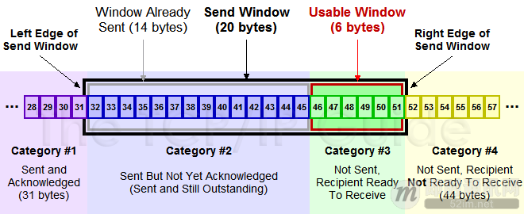
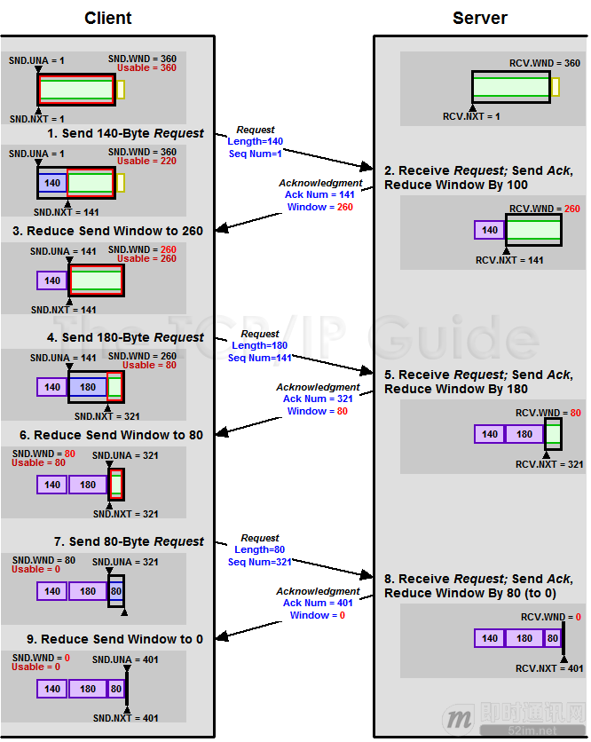

# TCP

[TOC]

## TCP三次握手与四次挥手


可靠性通过重传机制保证

重传机制

- 超时重传
- 快速重传
- SACK 方法


- 

## TCP流量控制

 流量控制基于滑动窗口协议（连续ARQ协议）实现

- 提供TCP的**可靠性**，TCP的传输要保证数据能够准确到达目的地，如果不能，需要能检测出来并且重新发送数据。
- 提供TCP的**流控特性**，管理发送数据的速率，不要超过设备的承载能力






Zero Window

上图，我们可以看到一个处理缓慢的Server（接收端）是怎么把Client（发送端）的TCP Sliding Window给降成0的。此时，你一定会问，如果Window变成0了，TCP会怎么样？是不是发送端就不发数据了？是的，发送端就不发数据了，你可以想像成“Window Closed”，那你一定还会问，如果发送端不发数据了，接收方一会儿Window size 可用了，怎么通知发送端呢？

解决这个问题，TCP使用了Zero Window Probe技术，缩写为ZWP，也就是说，发送端在窗口变成0后，会发ZWP的包给接收方，让接收方来ack他的Window尺寸，一般这个值会设置成3次，第次大约30-60秒（不同的实现可能会不一样）。如果3次过后还是0的话，有的TCP实现就会发RST把链接断了


### Silly Window Syndrome


Silly Window Syndrome翻译成中文就是“糊涂窗口综合症”。正如你上面看到的一样，如果我们的接收方太忙了，来不及取走Receive Windows里的数据，那么，就会导致发送方越来越小。到最后，如果接收方腾出几个字节并告诉发送方现在有几个字节的window，而我们的发送方会义无反顾地发送这几个字节。

要知道，我们的TCP+IP头有40个字节，为了几个字节，要达上这么大的开销，这太不经济了。

另外，你需要知道网络上有个MTU，对于以太网来说，MTU是1500字节，除去TCP+IP头的40个字节，真正的数据传输可以有1460，这就是所谓的MSS（Max Segment Size）注意，TCP的RFC定义这个MSS的默认值是536，这是因为 RFC 791里说了任何一个IP设备都得最少接收576尺寸的大小（实际上来说576是拨号的网络的MTU，而576减去IP头的20个字节就是536）。

如果你的网络包可以塞满MTU，那么你可以用满整个带宽，如果不能，那么你就会浪费带宽。（大于MTU的包有两种结局，一种是直接被丢了，另一种是会被重新分块打包发送） 你可以想像成一个MTU就相当于一个飞机的最多可以装的人，如果这飞机里满载的话，带宽最高，如果一个飞机只运一个人的话，无疑成本增加了，也而相当二。

所以，Silly Windows Syndrome这个现像就像是你本来可以坐200人的飞机里只做了一两个人。 要解决这个问题也不难，就是避免对小的window size做出响应，直到有足够大的window size再响应，这个思路可以同时实现在sender和receiver两端：


- 如果这个问题是由Receiver端引起的，那么就会使用 David D Clark’s 方案。在receiver端，如果收到的数据导致window size小于某个值，可以直接ack(0)回sender，这样就把window给关闭了，也阻止了sender再发数据过来，等到receiver端处理了一些数据后windows size 大于等于了MSS，或者，receiver buffer有一半为空，就可以把window打开让send 发送数据过来。
- 如果这个问题是由Sender端引起的，那么就会使用著名的 [Nagle’s algorithm](http://en.wikipedia.org/wiki/Nagle's_algorithm)。这个算法的思路也是延时处理，他有两个主要的条件：1）要等到 Window Size>=MSS 或是 Data Size >=MSS，2）收到之前发送数据的ack回包，他才会发数据，否则就是在攒数据。


另外，Nagle算法默认是打开的，所以，对于一些需要小包场景的程序——比如像telnet或ssh这样的交互性比较强的程序，你需要关闭这个算法。你可以在Socket设置TCP_NODELAY选项来关闭这个算法（关闭Nagle算法没有全局参数，需要根据每个应用自己的特点来关闭）

```
setsockopt(sock_fd, IPPROTO_TCP, TCP_NODELAY, (``char` `*)&value,``sizeof``(``int``));
```

另外，网上有些文章说TCP_CORK的socket option是也关闭Nagle算法，这不对。TCP_CORK其实是更新激进的Nagle算汉，完全禁止小包发送，而Nagle算法没有禁止小包发送，只是禁止了大量的小包发送。最好不要两个选项都设置。


## TCP拥塞控制

拥塞控制就是防止过多的数据注入网络中，这样可以使网络中的路由器或链路不致过载。拥塞控制是一个全局性的过程，和流量控制不同，流量控制指点对点通信量的控制。

- 慢启动，拥塞避免，
- 快重传、快恢复。

慢启动

慢开始，不要一开始就发送大量的数据，先探测一下网络的拥塞程度，也就是说由小到大逐渐增加拥塞窗口的大小。 

快重传

前面我们说过，当丢包的时候，会有以下两种情况。

**1）等到RTO超时，重传数据包。TCP认为这种情况太糟糕，反应也很强烈：**

- sshthresh = cwnd /2
- cwnd 重置为 1
- 进入慢启动过程


**2）Fast Retransmit算法，也就是在收到3个duplicate ACK时就开启重传，而不用等到RTO超时：**

- TCP Tahoe的实现和RTO超时一样。
- TCP Reno的实现是：
  - cwnd = cwnd /2
  - sshthresh = cwnd
  - 进入快速恢复算法——Fast Recovery


上面我们可以看到RTO超时后，sshthresh会变成cwnd的一半，这意味着，如果cwnd<=sshthresh时出现的丢包，那么TCP的sshthresh就会减了一半，然后等cwnd又很快地以指数级增涨爬到这个地方时，就会成慢慢的线性增涨。我们可以看到，TCP是怎么通过这种强烈地震荡快速而小心得找到网站流量的平衡点的。

参考文章

[TCP-IP详解：滑动窗口（Sliding Window）](https://blog.csdn.net/wdscq1234/article/details/52444277)

[[通俗易懂]深入理解TCP协议（下）：RTT、滑动窗口、拥塞处理](http://www.52im.net/thread-515-1-1.html)

[搞定计算机网络面试，看这篇就够了](https://juejin.im/post/5b737671518825612a227e91?utm_source=gold_browser_extension)


